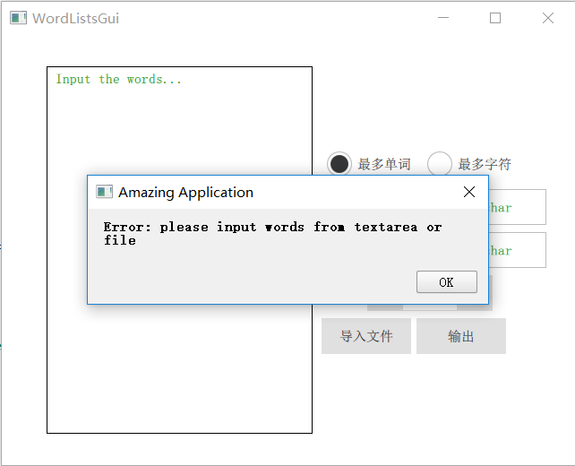
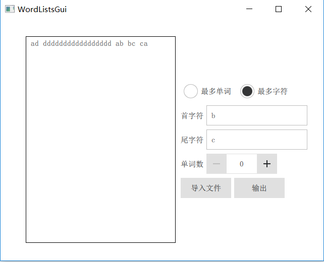

## 1. 用法

1. 命令行：

   ```bash
   1. mkdir build ; cd build
   2. cmake ..
   3. cmake --build . (编译环境需要支持C++11)
   or make (in linux)
   or msbuild WordLists.sln
   4. src/WordLists params(in Unix-like)
   or src/(Debug|Release)/WordLists params (Windows)
   ```

2. 使用GUI:

   1. 直接使用现成编译好的可执行文件(在GUI/bin中)(由于`Qt`依赖的库有点多，所以这个步骤取消)

   2. 自行使用`Qt5.12`编译：

      ```bash
      (在工程目录下)
      1. mkdir build; cd build; cmake ..
      2. cmake --build . --target install
      (上面这两步主要是将src目录下的源文件拷贝到GUI工程中，如果自行拷贝(拷贝到GUI/WordListsGui/WordLists/)可忽略)
      3. 使用qt打开`GUI/WordListsGui/WordListsGui.pro`文件
      4. 编译运行
      ```


## 2. 结果展示

1. 命令行：

2. GUI:

   在gui工程中可通过设置界面属性避免了一些非法输入，同时如果`-h`/`-t`输入的是字符串而不是字符则默认取第一个字符为输入，这样之后对错误处理可以简化跟多。下面为使用示例：

   主要界面：

   

   没有结果：

   

   成功输出：

   

   更多例子：

   

   

   


## 3. GUI设计

项目GUI使用`qml`进行前端设计，`c++`进行后端处理的方式来实现。`qml`的写法与`html`的写法相当类似。比如结果演示部分的代码：

```qml
ColumnLayout{
    Rectangle{
        border.color: "black"
        anchors.fill: parent
        ScrollView{
            anchors.fill: parent
                TextArea{
                //anchors.fill: parent
                id:output_text
                readOnly: true
                placeholderTextColor: "black"
                placeholderText: backend.result
                }
        }
    }
}
```

而后端处理则与命令行项目的`main.cpp`处理逻辑差不多，不多由于`GUI`输入使得处理输入简化了很多，所以后端处理实际上很简单。

至于数据交换部分，`QT`提供的接口页十分方便，只需要设置一系列变量，就能够在`qml`文件中使用这些变量：

```c++
    Q_OBJECT
    Q_PROPERTY(QString words READ words WRITE setWords NOTIFY wordsChanged)
    Q_PROPERTY(bool isw READ isw WRITE setIsw NOTIFY iswChanged)
    Q_PROPERTY(QString h READ h WRITE setH NOTIFY hChanged)
    Q_PROPERTY(QString t READ t WRITE setT NOTIFY tChanged)
    Q_PROPERTY(int n READ n WRITE setN NOTIFY nChanged)
    Q_PROPERTY(QString file READ file WRITE setFile NOTIFY fileChanged)

```

然后声明一个`BackEnd`实体：

```qml
    BackEnd{
        id:backend
    }
```

之后就可以如下面这样使用这些变量即可：

```qml
placeholderText: backend.result
```


