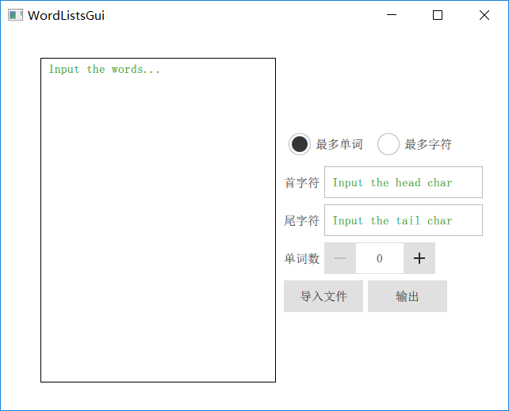
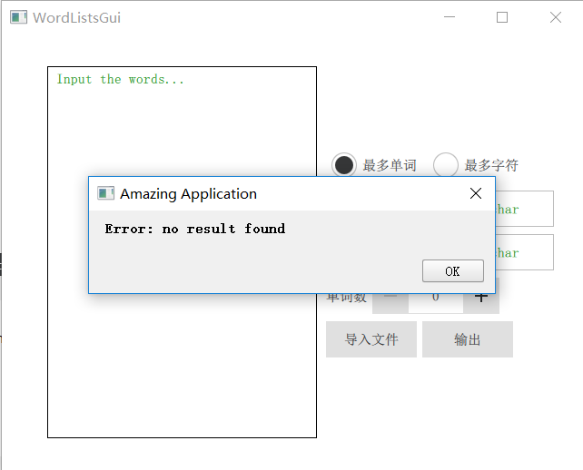
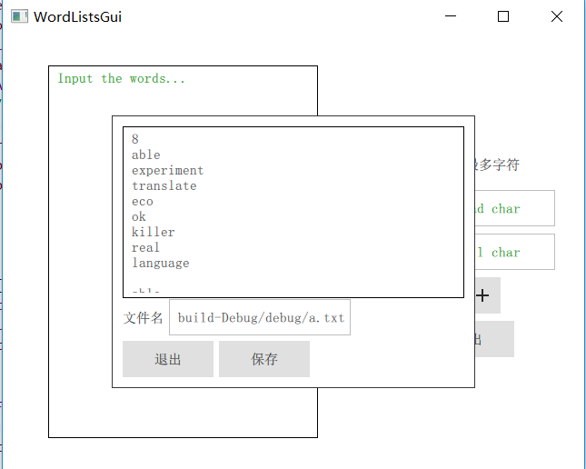

## 1. 用法

1. 命令行：

   ```bash
   1. mkdir build ; cd build
   2. cmake ..
   3. cmake --build . (编译环境需要支持C++11)
   or make (in linux)
   or msbuild WordLists.sln
   4. src/WordLists params(in Unix-like)
   or src/(Debug|Release)/WordLists params (Windows)
   ```

2. 使用GUI:

   1. 直接使用现成编译好的可执行文件(在GUI/bin中)

   2. 自行使用`Qt5.12`编译：

      ```bash
      (在工程目录下)
      1. mkdir build; cd build; cmake ..
      2. cmake --build . --target install
      (上面这两步主要是将src目录下的源文件拷贝到GUI工程中，如果自行拷贝(拷贝到GUI/WordListsGui/WordLists/)可忽略)
      3. 使用qt打开`GUI/WordListsGui/WordListsGui.pro`文件
      4. 编译运行
      ```


## 2. 结果展示

1. 命令行：

2. GUI:

   在gui工程中可通过设置界面属性避免了一些非法输入，同时如果`-h`/`-t`输入的是字符串而不是字符则默认取第一个字符为输入，这样之后对错误处理可以简化跟多。下面为使用示例：

   

   

   
