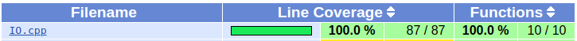

# Lab1-2说明文档

[TOC]

### 一、接口实现

**1、获取单数数量最多的单词链**

```c++
int gen_chain_word(char* raw, int len, char* result[], char head, char tail);
```

**参数说明：**

`raw`：需要处理的一整条字符串，如"end of the world"，不需要提前分词。

`len`：指示字符串中所含的单词数，此参数一般无效，设为0即可。

`result`：返回的一条单数数量最多的单词链。

`head`：对返回的结果单词链的首字符的要求，没有要求时输入0。

`tail`：对返回的结果单词链的尾字符的要求，没有要求时输入0。

`return value`：得到的符合条件的单词链包含的单词数量。

**实现细节：**

1、首先该接口会调用IO模块里的`getWords`函数，将传入的字符串分词、去重，将所有合法字符变为小写形式后转化成核心模块要求的数据结构`WordLists`。

2、接着该接口调用核心模块提供的`MostWords`函数，计算单词数量最多的单词链(该函数的具体实现在Lab1-1说明文档中已有详细叙述)，返回单词数量`resultnumber`和单词链`std::list<std::list<Word*> > &result)`。

3、最后接口将`MostWords`函数返回的`std::list<std::list<Word*> > &result)`转化为标准输出`char* result[]`。

**接口使用示例：**

```c++
char *input = "end of the world";
char *result[4] = {0}; //请注意必须要在调用接口之前指定result数组的大小，否则报错
int resultnum = gen_chain_word(input, 4, result, 0, 0);
//此时result变量中含有得到的结果字符串，可以直接打印
```

**2、获取字符数量最多的单词链**

```cpp
int gen_chain_char(char* raw, int len, char* result[], char head, char tail, char mode);
```

**参数说明：**

`raw`：需要处理的一整条字符串，如"end of the world"，不需要提前分词。

`len`：指示字符串中所含的单词数，此参数一般无效，设为0即可。

`result`：返回的一条单数数量最多的单词链。

`head`：对返回的结果单词链的首字符的要求，没有要求时输入0。

`tail`：对返回的结果单词链的尾字符的要求，没有要求时输入0。

`mode`：选择返回值，mode为0返回单词数，mode为1返回字符数。

`return value`：mode指定的返回值。

**实现细节：**

1、首先该接口会调用IO模块里的`getWords`函数，将传入的字符串分词、去重，将所有合法字符变为小写形式后转化成核心模块要求的数据结构`WordLists`。

2、接着该接口调用核心模块提供的`MostCharacters`函数，计算单词数量最多的单词链(该函数的具体实现在Lab1-1说明文档中已有详细叙述)，返回单词数量`resultnumber`和单词链`std::list<std::list<Word*> > &result)`。

3、最后接口将`MostCharacters`函数返回的`std::list<std::list<Word*> > &result)`转化为标准输出`char* result[]`。

**接口使用示例：**

```c++
char *input = "end of the world";
char *result[4] = {0}; //请注意必须要在调用接口之前指定result数组的大小，否则报错
int resultnum = gen_chain_char(input, 4, result, 0, 0, 1);
//此时result变量中含有得到的结果字符串，可以直接打印
```

**3、获取指定单词数量的单词链**

```cpp
int gen_chain_number(char* raw, int len, std::list<std::list<char*> > &result, char head, char tail, int number);
```

**参数说明：**

`raw`：需要处理的一整条字符串，如"end of the world"，不需要提前分词。

`len`：指示字符串中所含的单词数，此参数一般无效，设为0即可。

`result`：返回的一条单数数量最多的单词链，需要注意的是因为这个函数需要返回所有符合条件的单词链，所以上面两个接口中的类型已不适用，这里使用两层链表容器来表示所有的单词链，外层元素表示一条单词链，内层元素表示一个单词。

`head`：对返回的结果单词链的首字符的要求，没有要求时输入0。

`tail`：对返回的结果单词链的尾字符的要求，没有要求时输入0。

`number`：对单词数量的要求，请注意该值必须大于1，否则接口直接返回错误代码。

`return value`：得到的符合条件的单词链数量。

**实现细节：**

1、首先该接口会调用IO模块里的`getWords`函数，将传入的字符串分词、去重，将所有合法字符变为小写形式后转化成核心模块要求的数据结构`WordLists`。

2、接着该接口调用核心模块提供的`RequiredNumber`函数，计算单词数量最多的单词链(该函数的具体实现在Lab1-1说明文档中已有详细叙述)，返回单词数量`resultnumber`和单词链`std::list<std::list<Word*> > &result)`。

3、最后接口将`RequiredNumber`函数返回的`std::list<std::list<Word*> > &result)`转化为标准输出`std::list<std::list<char*> > result`。

**接口使用示例：**

```c++
char *input = "end of the world";
std::list<std::list<char*> > result;
int resultnum = gen_chain_char(input, 4, result, 0, 0, 2);
//此时result变量中含有得到的结果字符串，遍历链表容器打印即可
```

**4、WordLists数据结构**

```c++
struct Word{
    char first;
    char last;
    int len;
    char* raw;
    Word():first('\0'),last('\0'),len(0),raw(nullptr){}
};

struct ListNode{
	struct Word *w;
	Color color;
	long distance;
	ListNode *pi;
	long d;
	long f;
    ListNode():
        w(nullptr),color(WHITE),distance(0),pi(nullptr),
        d(0),f(0){}
};

struct WordList{
    std::list<ListNode> hlist;
    std::list<ListNode> tlist;
};
```

## 二、单元测试

### 1. 测试工具说明

本项目使用`gtest`, `cmake`, `gcov/lcov`进行单元测试，其中`gcov`是用来查看覆盖率的，由于目前`gcov`只内置与`gcc`中，所以本单元测试模块如果需要查看覆盖率需要使用`gcc`编译器。**注意：如果构建环境中不存在`gcov`则需要将src/CMakeLists.txt:15-22行的内容注释掉。**

测试步骤：

```bash
#在UnitTest目录下
mkdir build; cd build;
cmake ..
cmake --build .
#运行测试程序可以使用cmake自带的工具ctest
ctest ##直接在构建目录下运行测序即可
#也可以单独运行测试程序
./io_test;./interface_test
```

值得注意的是，测试模块使用`gtest`框架，但不需要自己下载`gtest`源码并自行构建，我们使用配置`CMakeLists.txt`的方式使这一步骤自动化进行，这要求在运行`cmake`时需要保证联网环境。

### 2. IO模块的测试及gtest用法示例

`googletest`测试框架非常好用，只需要使用`TEST(){}`宏就可以声明一个测试函数，然后使用`EXPECT_*`或`ASSERT_*`两类宏就可以进行绝大部分的测试。比如在`io_test.cpp`中的例子：

```C++
TEST(fileToStr, invalid_file){
    char* p = nullptr;
    string file = "no_exists.txt";
    string file2 = "no_exists2.txt";
    EXPECT_EQ(1, fileToStr(&file[0],&p));
    EXPECT_EQ(nullptr, p);
    EXPECT_EQ(1, fileToStr(&file[0],&p));
    EXPECT_EQ(nullptr,p);
}
```

IO虽然简单，但是测试模块仍然进行了充足的测试，大部分函数都针对多种情况进行了测试，最后`lcov`覆盖率检查显示覆盖率达到了`100%`:



