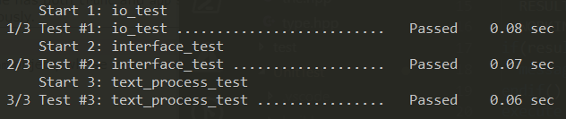

# Lab1-3说明文档

[TOC]

## 异常处理

### 一、预处理中的异常

由于原来接口的定义中，`get_words_*`等接口函数只需要传入字符串的原始数据(单词去重等在将字符串转成我们的数据结构的时候会进行处理)，所以在封装`text_process`接口时只需要处理传入空指针以及打开文件失败的异常情况即可。由于如果文件为空的话对于后面的处理没有任何意义，所以文件为空也被当做异常处理。考虑到读取文件失败可能不是使用者的程序中的致命错误，所以这里异常处理采用抛出异常的方式对异常进行处理，而不是终止应用程序。至于产生异常后如何处理，由接口的调用者来处理。

由于此前就已经在`IO.hpp`封装有`fileToStr`接口，并且在单元测试中已经针对该函数进行了充分的测试，所以只需要根据它的函数返回值加入异常处理进一步封装即可。由于该接口主要面向调用者，所以我们将`text_process`接口封装在`interface.hpp`中。具体代码如图所示：

```c++
char* text_process(const char* file){
    char *p = nullptr;
    if(file == nullptr){
        throw std::invalid_argument("argument can not be nullptr");
    }
    int state = fileToStr(file,&p);
    if(state == 1){
         throw std::invalid_argument("Open file failed!\n"
            "Please check whether the file exists,"
            "or whether you have permission to access the file");
    }
    else if(state == -1){
        throw std::invalid_argument("It is empty file");
    }
    return p;
}
```


### 二、接口中的异常

**1、指定的首尾字符串不是英文字母**

**检测函数：**

```c++
char check_char(char c){
    try
    {
        if(c >= 'A' && c <= 'Z'){
            return c - 'A' + 'a';
        }
        else if(!(c >= 'a' && c <= 'z') && c != 0){
            throw HEADORTAIL_ILLEGAL;
        }
        else
            return c;
    }
    catch(int err)
    {
        error_handler(err);
    }
	return c;
}
```

这一函数会检测指定的首尾字符串是否是字母，如果是字母会将其转化为小写并返回，如果不是字母则会触发异常处理函数。

**异常处理：**

因为首尾字符参数直接影响到了后续程序的执行，如果指定的不是字母，则直接抛出异常并终止程序执行。

**2、检测输入的参数len是否大于0**

**检测函数：**

```cpp
void check_len(int len){
    try
    {
        if(len <= 0)
            throw LEN_LESSTHANZERO;
    }
    catch(int err)
    {
        error_handler(err);
    }
}
```

这一函数会检测len是否大于0，如果小于等于0则会触发异常处理函数。

**异常处理：**

因为这一参数在我们的程序中作用不大，所以只会给出提示，不会终止程序执行。

**3、检测输入的参数number是否大于1**

**检测函数：**

```cpp
void check_number(int number, int len){
    try
    {
        if(number <= 1)
            throw NUMBER_LESSTHANONE;
        if(number > len)
            throw NUMBER_LARGERTHANLEN;
    }
    catch(int err)
    {
        error_handler(err);
    }
}
```

这一函数会检测指定的number是否大于1同时检测number与len的关系，如果number大于1或者number大于len则会触发异常处理函数。

**异常处理：**

如果异常是number小于等于1，因为这种异常会直接影响到后续程序的执行，所以直接终止程序。

如果异常是number大于len，因为len参数对于程序执行意义不大，所以只会给出提示，不会终止程序执行。

**4、检测调用的核心算法函数的返回值**

**检测函数：**

```cpp
void check_returnvalue(int returnvalue){
    try
    {
        if(returnvalue == -1)
            throw HEADORTAIL_ILLEGAL;
        if(returnvalue == -2)
            throw NOTFOUNDD;
        if(returnvalue == 0)
            throw UNKNOWNERROR;
    }
    catch(int err)
    {
        error_handler(err);
    }
}
```

核心算法函数的返回值如果小于等于0，则表示出现异常：返回-1代表输入的首尾字符串不合法，返回-2代表找不到符合要求的字符串。一般不会返回0，如果返回0则代表出现了超出预期的异常。

**异常处理：**

当检测到上述返回值时，代表核心的算法函数执行失败，这时会直接输出异常信息并且终止程序执行。

**5、检测mode参数的合法性**

**检测函数：**

```cpp
int check_mode(int mode, int mode_0, int mode_1){
    try
    {
        if(mode == 0)
            return mode_0;
        else if(mode == 1)
            return mode_1;
        else
            throw ILLEGAL_MODE;
    }
    catch(int err)
    {
        error_handler(err);
    }
}
```

因为gen_chain_char的返回值可能会有两种，一种是单词链的单词数，一种是单词链的字符数，所以需要调用者使用mode参数来指定，这一参数为0时表示返回单词数，为1时表示返回字符数，其余的输入均为非法，检测到非法输入时会抛出异常。

**异常处理：**

如果mode参数非法，会直接影响到函数的返回值，故会直接输出异常信息并且终止程序执行。

**6、异常处理函数**

```cpp
void error_handler(int err){
    switch(err){
        case HEADORTAIL_ILLEGAL:
            printf("ERROR:The head or tail character is illegal!\n");
            break;
        case NUMBER_LESSTHANONE:
            printf("ERROR:The specified number must be larger than 1.\n");
            break;
        case NOTFOUNDD:
            printf("ERROR:Unable to find the required word chain.\n");
            break;
        case LEN_LESSTHANZERO:
            printf("ERROR:Len must be larger than 0.\n");
            return;
            break;
        case NUMBER_LARGERTHANLEN:
            printf("ERROR:Number must be less than len.\n");
            return;
            break;
        case ILLEGAL_MODE:
            printf("ERROR:Illegal mode.\n");
            break;
        case UNKNOWNERROR:
            printf("ERROR:Unknown error happened.\n");
            break;
        default:
            return;
    }
    exit(0);

}
```

## 测试

### 一、text_process异常处理测试结果

针对`text_process`的异常处理测试，我们继续使用此前的测试框架`gtest`，并将测试代码至于`UnitTest/text_process_test.cpp`中，使用`cmake`自带的工具`ctest`除了可以运行新增的异常测试，还可以直接运行以前的单元测试，简单方便，`cmake`和`ctest`在本项目中的使用可参见此前的实验文档。测试代码如下：

```cpp
TEST(text_process,nullptr_exception){
    try{
        char *p = nullptr;
        p = text_process(nullptr);
    }
    catch(const invalid_argument &e){
        cout<<e.what()<<endl;
        return;
    }
    FAIL();// it should not reach here.
}
```

完整测试可参见`UnitTest/text_process_test.cpp`.

测试结果：



由结果可知，对代码的改动没有影响程序的正确性，同时异常处理符合预期。

### 一、针对异常处理测试的说明

因为在原工程中，我们调用的函数为`MostWords`、`MostCharacters`、`RequiredNumber`三个函数，而不是要求的三个接口函数`gen_chain_word`、`gen_chain_char`、`gen_chain_number`，所以我们在原`main.cpp`的基础上重新设计了一个`test.cpp`文件用以测试三个接口函数能否对异常做出处理。需要特别说明地是，三个接口函数最终依然是靠调用三个核心函数来实现其功能的，但异常检测函数仅包含于接口函数中，当检测到异常时会直接抛出而不会再调用核心函数，这是设计`test.cpp`文件的原因。

首先，我们提供了调用核心函数得到的结果用以和接下来测试结果进行比较：


### 二、异常处理测试

**1、参数正确使用**


通过与调用核心函数得到的结果对比，可以看到，因为接口函数是更上层的函数，所以它的使用不会影响到核心函数的正确性，得到的结果是正确的。
>注1：因为len参数在我们的接口中基本无作用，所以事先将其设为0，而异常处理认为len==0是一种异常而抛出，但其对程序的运行无影响，因为它无关紧要。

>注2：在`test.cpp`中，我们新添加了一个参数-m，用以读取mode值，该参数会在测试mode正确性时使用到，如果不像上图特别声明，它默认为0，代表它输出的数字是单词链单词数，1则表示单词链的字母数。

**2、指定的首尾字符串不是英文字母**


可以看到，我们分别对三种情况分别进行了测试，只要是要求的首尾字母中有一个是英文字母就会抛出异常：`ERROR:The head or tai character is illegal!`。

**3、检测输入的参数len是否大于0**


同样地，我们也添加了一个参数-l用以改变len的值(虽然对我们的算法来说len的值对结果完全没有什么影响)，它默认值是0，我们可以更改其值，但不改变结果。唯一有区别的是，当其值为0时，会抛出异常：`ERROR:Len must be larger than 0`，这样，len参数是否大于0就得到了检测。

**4、检测输入的参数number是否大于1**


与正确结果相比，我们得到一个异常提示：`ERROR:The specified number must be larger than 1`，因为只有当number参数大于1时才是有效的，所以不大于1时，都会抛出异常。

**5、检测调用的核心算法函数的返回值**


在上图中，我们得到了三个异常提示，其中第一、第二提示均与len有关，这是无关紧要的，所以不会直接中止程序，但第三个异常是致命的。它告诉我们，`ERROR:Unable to find the required word chain`，即找不到要求的单词链，说明了不符合要求的单词链。另外地，核心算法函数返回-1时，即是我们的第一个测试：首尾字符不合法，两者都会终止程序执行。

**6、检测mode参数的合法性**


在注2中提到过，我们为`test.cpp`提供了一个新参数mode，用以调整输出格式，它默认是0，表示输出的是单词链的单词数，可以通过手动更改为其他数，但其中只有0(单词链的单词数)、1(单词链的字母数)是有意义的，更改为其他数会抛出异常`ERROR:Illegal mode`，从而终止程序。
