# Lab01设计文档

**组长：彭昀**

**组员：刘奕品、韦俊朗**

[TOC]

## 0. 文档说明

**组员分工：**

**彭昀：**主要编写核心算法实现和程序调试

**刘奕品：**主要负责IO函数编写和GUI设计

**韦俊朗：**主要负责测试样例设计及测试

## 1. 基本功能实现

如何build项目以及如何使用写在`readme.md`文档中，具体用法和结果展示写在测试结果中，`gui`附加功能的实现和结果放在最后。

### 1、最多单词数量的单词链求解

**问题描述：**

求最长单词链的问题可以转化为有向有环图的最长简单路径求解问题：

每个单词可以看做图的一个顶点，当单词A的尾字母与单词B的首字母一样时，产生一条从A到B的有向边，每条边的权重为1，我们要求解的就是这个图中的最长简单路径。

**求解方法：**

可以借鉴单源最短路径求解的Dijkstra算法，将路径松弛操作修改为$d_i(x) = max\{d_i(x), l_{ji}(x) + d_j(x)\}$，依次对每个顶点进行松弛，最后得到$d_(x)$最大的顶点，它就是最长单词链的最后一个结点，从这个结点向前回溯即可得到完整的单词链，对所有的顶点都应用一次上面的算法，得到的最长单词链中最长的即为所求。

**优化操作：**

上面描述的算法时间复杂度比较高，故为了降低程序运行时间，我们先将整个图进行一次拓扑排序，然后依照拓扑排序的次序进行松弛，每一个顶点在应用单源最长路径算法时可以只对它后面(拓扑序)的结点进行松弛操作，故可以大大降低时间复杂度。

**关键代码：**

```c++
long MostWords2(struct WordList *wordlist, char head, char tail, list<list<Word*> > &result){
	long chainlength = 0;
	long currentlength = 0;
	list<ListNode*> topo;
	list<list<Word*> > currentlongest;
	DFS(wordlist, topo, head, tail);

	for(auto index = topo.begin(); index != topo.end(); index++){
		currentlongest.clear();
		if(!((head == 0 || (head >= 'a' && head <= 'z')) && (tail == 0 || (tail >= 'a' && tail <= 'z')))){
			return NOTENGLISHLETTER;
		}
		else if(head == 0){
			currentlength = SingleSourceLongestPath(wordlist, topo, currentlongest, index, 0, tail, -1);
			if(chainlength < currentlength){
				chainlength = currentlength;
				result.clear();
				result.splice(result.end(),currentlongest);
			}
			else if(chainlength == currentlength && currentlength != 0){
				result.splice(result.end(),currentlongest);
			}
		}
		else if('a' <= head && head <= 'z' && (*index)->w->first == head){
			currentlength = SingleSourceLongestPath(wordlist, topo, currentlongest, index, 0, tail, -1);
			if(chainlength < currentlength){
				chainlength = currentlength;
				result.clear();
				result.splice(result.end(),currentlongest);
			}
			else if(chainlength == currentlength && currentlength != 0){
				result.splice(result.end(),currentlongest);
			}
		}
		
	}
	if(chainlength == 0)
		return NOTFOUND;
	return chainlength;
}
```

### 2、最多字符数的单词链求解

这一需求的求解方法与上面的需求大致相同，只是在构建图的过程中边A->B的权重是单词B的字符数，然后应用上面相同的算法即可求解。

**关键代码：**

```c++
long MostCharacters2(struct WordList *wordlist, char head, char tail, list<list<Word*> > &result){
	long chainlength = 0;
	long currentlength = 0;
	list<ListNode*> topo;
	list<list<Word*> > currentlongest;
	DFS(wordlist, topo, head, tail);
	for(auto index = topo.begin(); index != topo.end(); index++){
		currentlongest.clear();
		if(!((head == 0 || (head >= 'a' && head <= 'z')) && (tail == 0 || (tail >= 'a' && tail <= 'z')))){
			return NOTENGLISHLETTER;
		}
		else if(head == 0){
			currentlength = SingleSourceLongestPath(wordlist, topo, currentlongest, index, 1, tail, -1);
			if(chainlength < currentlength){
				chainlength = currentlength;
				result.clear();
				//result.merge(currentlongest);
				result.splice(result.end(),currentlongest);
			}
			else if(chainlength == currentlength && currentlength != 0){
				//result.merge(currentlongest);
				result.splice(result.end(),currentlongest);
			}
		}
		else if('a' <= head && head <= 'z' && (*index)->w->first == head){
			currentlength = SingleSourceLongestPath(wordlist, topo, currentlongest, index, 1, tail, -1);
			if(chainlength < currentlength){
				chainlength = currentlength;
				result.clear();
				//result.merge(currentlongest);
				result.splice(result.end(),currentlongest);
			}
			else if(chainlength == currentlength && currentlength != 0){
				//result.merge(currentlongest);
				result.splice(result.end(),currentlongest);
			}
		}
		
	}

	if(chainlength == 0)
		return NOTFOUND;
	return chainlength;
}
```

### 3、指定单词数的单词链求解

**求解方法：**

这一需求有两种求解方法：

**1、**可以使用广度优先搜索BFS搜索深度为指定单词数的单词，然后回溯形成完整单词链即可。要求解所有的指定长度单词链，对所有的单词应用上述算法，返回所有符合条件的单词链。

**2、**可以在上面求解最长单词链的过程中求解此问题，在松弛顶点的时候，一旦某个时间顶点的距离正好符合单词数的要求，就立即返回这个单词链，这种算法与实现其他需求的算法基本一致，可以共用函数减少代码量。

**关键代码：**

```c++

long RequiredNumber2(struct WordList *wordlist, char head, char tail, long number, list<list<Word*> > &result){
	long chainnumber = 0;
	long currentlength = 0;
	list<ListNode*> topo;
	list<list<Word*> > currentchain;
	list<list<Word*> > currentlongest;
	list<list<Word*> > temp_result;
	DFS(wordlist, topo, head, tail);
	for(auto index = topo.begin(); index != topo.end(); index++){
		currentlongest.clear();
		if(!((head == 0 || (head >= 'a' && head <= 'z')) && (tail == 0 || (tail >= 'a' && tail <= 'z')))){
			return NOTENGLISHLETTER;
		}
		else if(head == 0){
			currentlength = SingleSourceLongestPath(wordlist, topo, currentlongest, index, 0, tail, number);
			if(number == currentlength){
				result.splice(result.end(),currentlongest);
			}
		}
		else if('a' <= head && head <= 'z' && (*index)->w->first == head){
			currentlength = SingleSourceLongestPath(wordlist, topo, currentlongest, index, 0, tail, number);
			if(number == currentlength){
				result.splice(result.end(),currentlongest);
			}
		}
	}
		for(auto i = result.begin(); i != result.end(); i++){
		if((*i).front()->first == (*i).back()->last){
			list<Word*> temp;
			long size = (*i).size();
			for(auto x = (*i).begin(); x != (*i).end(); x++){
				temp.push_back(*x);
			}
			for(int k = 0; k < size - 1; k++){
				Word* front = temp.front();
				temp.pop_front();
				temp.push_back(front);
				if((head == 0 && tail == 0) || (head != 0 && temp.front()->first == head && tail == 0) 
					|| (head !=0 && temp.front()->first == head && tail != 0 && temp.back()->last == tail)
					|| (head == 0 && tail != 0 && temp.back()->last == tail))
				result.push_front(temp);
			}
		}
	}
	
	chainnumber = result.size();
	if(chainnumber == 0)
		return NOTFOUND;
	return chainnumber;
}
```

### 4、指定首尾字符的单词链求解

这一需求不能单独存在，必须与其他需求组合起来实现：

**与最多单词数量或者最多字符数的单词链需求组合：**

**求解方法：**

若指定单词链的首字符，则我们在求解最长单词链的过程中不必要对每一个顶点都应用一次单源最长路径算法，只需要对符合首字符要求的单词所在的顶点应用单源最长路径算法即可，最后从得到的局部最长路径中选择全局最长路径即可。

若指定单词链的尾字符，则在单源最长路径算法最后选择局部最长路径时，加入尾字符是否满足要求的条件即可。

若同时指定首尾字符，则将上述算法结合即可。

**关键代码：**(部分已在上面列出的关键代码中实现)

```c++
long SingleSourceLongestPath(struct WordList *wordlist, list<ListNode*> &topo, list<list<Word*> > &currentlongest,
							 list<ListNode*>::iterator head, char mode, char tail, long number){
	for(auto index2 = topo.begin(); index2 != topo.end(); index2++){
		(*index2)->distance = NINF;
		(*index2)->pi = nullptr;

	}
	(*head)->distance = 0;
	long length = 0;
	list<ListNode> lastword;
	for(auto index = head; index != topo.end(); index++){
		if((*index)->distance != NINF){
			char adj = (*index)->w->last;
			auto k = index;
			k++;
			for(; k != topo.end(); k++){
				auto i = *k;
				if ((*i).w->first != adj)
					continue;
				if(!mode && ((*i).distance < ((*index)->distance + 1))){
					(*i).distance = (*index)->distance + 1;
					(*i).pi = *index;
				}
				else if(mode && ((*i).distance < ((*index)->distance + (*i).w->len))){
					(*i).distance = (*index)->distance + (*i).w->len;
					(*i).pi = *index;
				}
				if(length < (*i).distance && tail == 0 && number == -1){
					length = (*i).distance;
					lastword.clear();
					lastword.push_front(*i);
				}
				else if(length == (*i).distance && tail == 0 && number == -1){
					int flag = 0;
					for(auto iter = lastword.begin(); iter != lastword.end(); iter++){
						if(strcmp((*iter).w->raw, (*i).w->raw) == 0)
							flag = -1;
					}
					if(flag == 0)
						lastword.push_front(*i);
				}
				else if(length < (*i).distance && tail != 0 && (*i).w->last == tail && number == -1){
					length = (*i).distance;
					lastword.clear();
					lastword.push_front(*i);
				}
				else if(length == (*i).distance && tail != 0 && (*i).w->last == tail && number == -1){
					int flag = 0;
					for(auto iter = lastword.begin(); iter != lastword.end(); iter++){
						if(strcmp((*iter).w->raw, (*i).w->raw) == 0)
							flag = -1;
					}
					if(flag == 0)
						lastword.push_front(*i);
				}
				else if(number != -1 && (*i).distance == number - 1 && tail == 0 && !mode){
					length = number - 1; 
					int flag = 0;
					for(auto iter = lastword.begin(); iter != lastword.end(); iter++){
						if(strcmp((*iter).w->raw, (*i).w->raw) == 0)
							flag = -1;
					}
					if(flag == 0)
						lastword.push_front(*i);
				}
				else if(number != -1 && (*i).distance == number - 1 && tail != 0 && (*i).w->last == tail && !mode){
					length = number - 1;
					int flag = 0;
					for(auto iter = lastword.begin(); iter != lastword.end(); iter++){
						if(strcmp((*iter).w->raw, (*i).w->raw) == 0)
							flag = -1;
					}
					if(flag == 0)
						lastword.push_front(*i);
				}
				}
			}
		}
	if(lastword.size() != 0){
		for(auto j = lastword.begin(); j != lastword.end(); j++){
		list<Word*> longest;
		auto x = &(*j);
		while(x->distance != 0){
			longest.push_front(x->w);
			x = x->pi;
		}
		longest.push_front(x->w);
		currentlongest.push_front(longest);
	}
	}
	else{
		list<Word*> longest;
		longest.push_front((*head)->w);
		currentlongest.push_front(longest);
	}

	if(!mode)
		return length+1;
	else
		return length+(*head)->w->len;
}
```

### 5. 与指定单词数量的单词链需求组合：

若指定单词的首字符，同理只需要对首字符符合要求的顶点应用指定单词数量的算法；若指定尾字符，则在确定结果时需要加一个条件判断尾字符是否满足要求。

关键代码在上面的与最长单词链组合的需求的关键代码中已实现。

## 2. 测试样例设计及测试结果

### 测试样例1：基础用法说明

该测试样例使用了助教提供的文档中样例，对这个测试样例进行测试可以简单检测程序是否能够正确地执行简单的样例，对test1.txt进行的操作及结果如下：

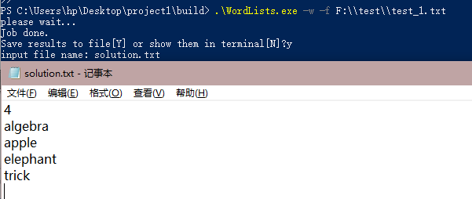

上图为在Windows Powershell下的运行结果，通过命令行使用-w参数加文件名的形式计算了最多单词数量的英语单词链。在得到Job done的结果提示后用户可以选择是否将存储到文件中，当确认要存入时，会要求用户提供一个文件名用以创建文件并存储。得到的结果在上图中名为solution.txt的文本文件中显示。

> 注1：-f参数的使用取决于用户是否要从文本文件中读取单词，若在命令行中以字符串的形式输入则不需要，不使用-f参数的结果如下图：

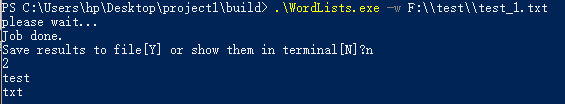 

该输入未使用-f参数，从而程序将输入的路径识别为字符串输入从而得到结果。

> 注2：为方便展示程序运行结果，以下测试结果将不再存入文件中，而是在命令行中直接输出。

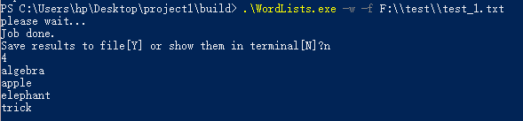

上图为程序在命令行下执行-w参数的运行结果，数字4为单词链的单词数，后接搜索到的单词链。

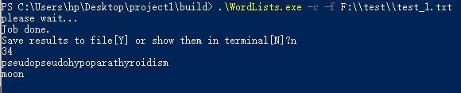

上图为程序在命令行下执行-c参数的运行结果，数字34为搜到的字母最多的单词链的字母数，后接搜索到的单词链。


上图为程序在命令行下执行-t参数的运行结果，其中第二个字母t表示指定的尾字母为t的单词链，数字3为单词链的单词数，后接搜索到的单词链。


上图为程序在命令行下执行-h参数的运行结果，其中第二个字母e表示指定的首字母为t的单词链，数字2为单词链的单词数，后接搜索到的单词链。

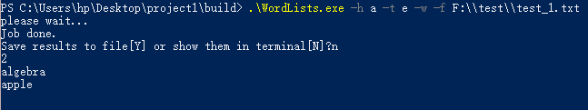

上图为程序在命令行下-t参数及-h参数结合使用的运行结果，其中第二个字母a表示指定的首字母为a的单词链，第四个字母e表示指定的尾字母为e的单词链，二者结合即要求单词链为的首尾字母分别为a、e的单词链，搜索成功则会弹出Job done提示，输出在命令行中时，数字2为单词链的单词数，后接搜索到的单词链。


对于指定单词链的单词个数，可以用-n参数来查询，如上图所示，利用-n和3两个参数，搜索了test_1.txt中满足单词个数为3的单词链，得到了两个结果，将其输出在命令行中即如上图所示。

至此，对于简单测试文件已经测试完毕，其结果和人工运算结果相比较是完全一致的，程序的正确性得到初步的肯定。

### 测试样例2：大小写敏感测试

**该测试样例主要目的是测试程序对文本文件中的单词大小写是否敏感**，该样例所对应的测试文档test_2.txt中存在某些单词不是完全由小写字母组成的，通过该样例可以测试程序是否能将这些字母大小写不统一的大小写字母统一化。

仿照测试样例1中的5种参数输入，得到的输出结果如下，其中-h参数及-t参数不再单独测试，而改以复合形式直接测试。

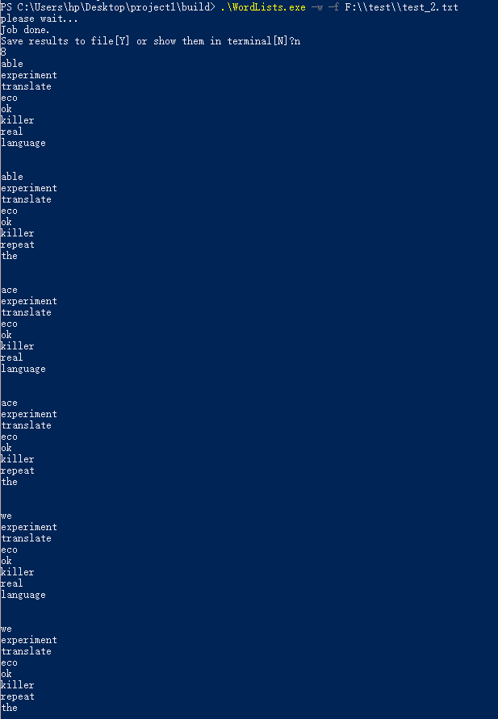

使用-w参数查找单词数最多的单词链，得到的输出结果。

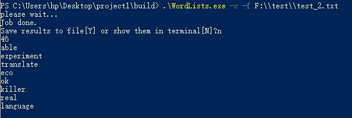

使用-c参数查找字母数最多的单词链，得到的输出结果。


复合使用-h及-t参数，查找首字母为e尾字母为r的单词链，得到的输出结果。

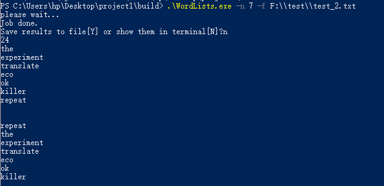

使用-n参数查找单词链长度为7的单词链，得到的输出结果。

通过以上参数测试，验证了程序具有将大小写字母统一化的功能。

### 测试样例3：单词去重测试

该测试样例主要目的是测试程序是否拥有对重复单词进行去重的功能，该样例所对应的测试文档test_3.txt中存在某些单词不仅仅只使用一次，通过该样例的测试，可以检验程序的去重功能。

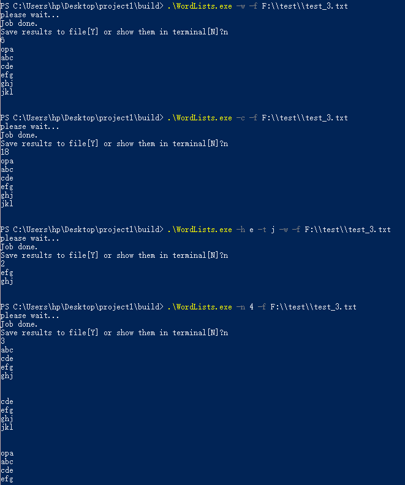

上图为分别使用5种参数的运行结果。可以看到，无论使用哪个参数得到的单词链，均不存在重复使用某个单词的情况，从而检验了程序的去重功能。

### 测试样例4：文件不存在测试

该测试样例所对应的测试文档为test_4.txt，但在指定目录下不存在名为test_4.txt的文档，故这个测试样例的设计目的是测试程序在对文件不存在/输入路径不正确/路径不合法时的给予用户的提示。

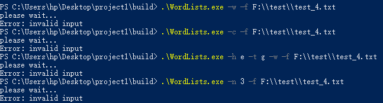

上图显示了当用户输入的文件不存在或输入路径不正确或路径不合法时程序的给予用户的反馈提示，此时无论使用何种参数，程序都会提示这是一个无效的输入，检验程序对该异常的处理功能。

### 测试样例5：不存在单词测试

该测试样例所对应的测试文档为test_5.txt，该文档存在，但其中均为非字母符号，即文档存在但文档中无单词，设计该样例可以检验程序是否拥有对该种异常进行处理的功能。

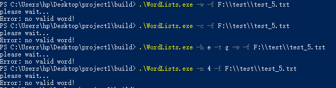

由上图可以看到，当从输入路径读取到文件，但文件中不存在单词时，程序会返回no valid word!语句提示用户文件中没有有效的单词，与测试样例4进行比较，两种异常拥有两种不同的反应，检验了程序有对文件存在但无单词的情况进行反馈的功能。

### 测试样例6：不存在单词链测试

测试样例test_6.txt中存在单词，但这些单词都不能构成长度大于等于2的单词链，设计该样例的目的是检验程序是否有对文件存在且有单词但无单词链这一异常情况进行反馈的功能。

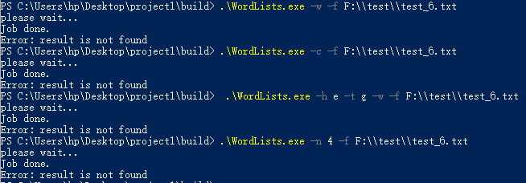

通过上图以及与测试样例5的比较，可以看到当文件存在且有单词但无单词链这种情况发生时，程序会正确运行，得到结果Job done，但无论使用何种参数，都搜索不到结果，均会向用户提示，没有查询到结果(result is not found)从而与测试样例5区分。

### 测试样例7：指定单词数大于最大单词链长度

测试样例test_7.txt中仅有3个单词，且这3个单词能够构成一个长度为3的单词链，该样例主要测试当用户使用-n参数搜索时指定数字大于最大单词链长度时程序如何反应。

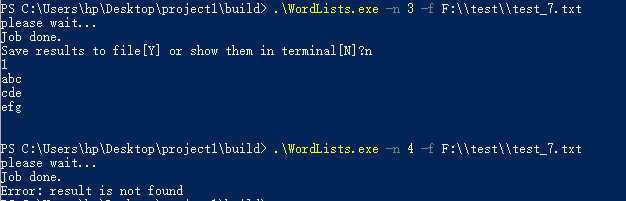

通过比较，可以看到当用户指定的单词链长度过大，无法在文本中搜索到符合要求的单词链时，程序会向用户反馈查找不到结果(result is not found)。

### 测试样例8：单词环中环测试

测试样例test_8.txt中有4个单词，这4个单词可以构成8个2长度的小环、2个3长度的中环以及1个4长度的大环，该样例的设计是为了验证程序所使用的算法能否处理对多环形成大环这一个特殊情况，并输出相对应的正确结果。

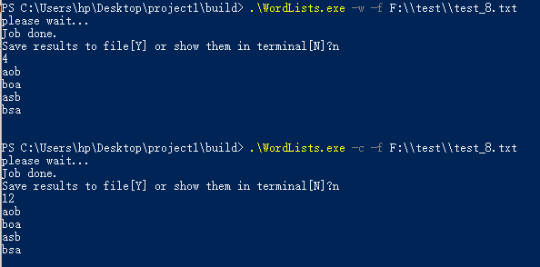

当使用-w以及-c参数进行查找时，环状结构对结果无影响。

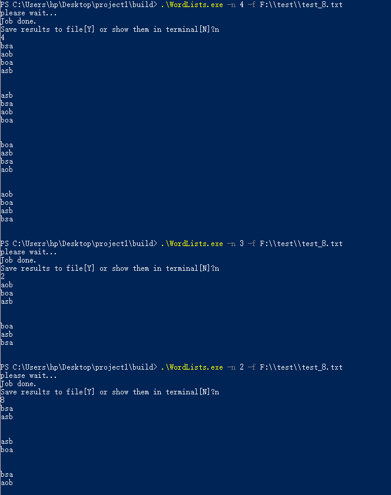

同样地，使用-n参数查询固定长度的单词链时也能输出正确的结果，通过这个例子验证了环状结构对于程序的正确运行无影响，即程序拥有对该特殊情况进行处理的功能。

### 测试样例9：综合测试

测试样例2以及测试样例3分别检验了程序对大小写是否敏感以及是否有去重功能，但未将两者结合考虑。测试样例test_9.txt包含了重复单词且重复单词是用大小写区分的，设计该样例是为了检验程序是否有应对综合两种情况的功能。

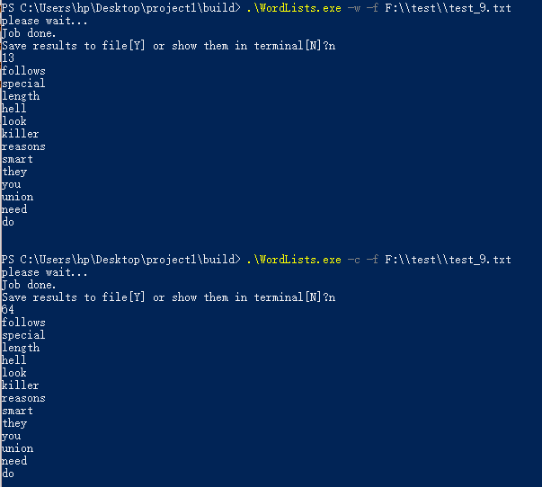

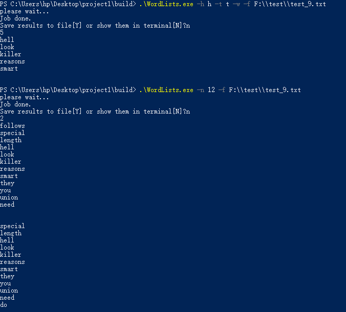

以上两图给出了在复杂情况下面对4种不同参数程序运行的结果，从输出结果可以看出程序可以同时处理大小写转化以及去重的情况。

### 测试样例10：超大数据集

测试样例test_10.txt是一个包含有999个单词的数据集，设计该样例的目的是为了检验程序是否拥有对较大数据集进行处理的能力。

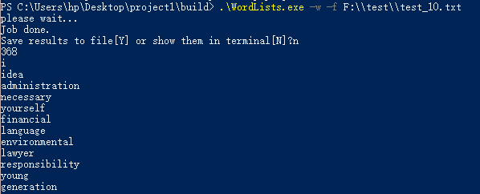

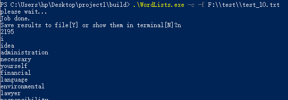

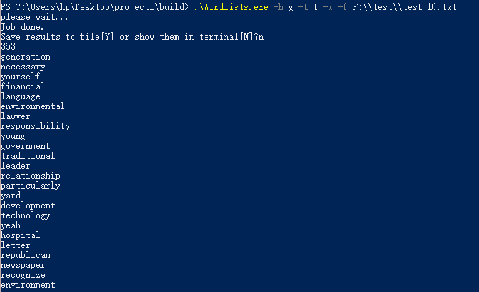

上述结果从程序开始执行到输出结果的过程均在秒级(2s内)完成，说明算法已经进行优化，程序的性能测试是达标的。

我们继续测试了更大的数据集(test.txt, 3000+)，结果也是很理想的，能够在半分钟内得出结果：

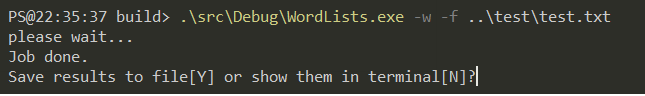

 注：-n参数因为测试样例数据过大，输出在命令行时不方便截取以及查看，如有需要可选择存入文件查看。

### 测试样例11：非法参数测试

测试样例11主要目的是验证程序能否提示用户正确的输入参数，从而执行相应的功能，即程序应拥有在用户输入错误时引导用户正确输入的功能。

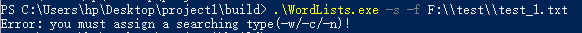

上图中使用了一个-s的参数，但这个参数是程序无法识别的，所以程序返回了一个Error提示，这个提示包含的信息可以引导用户输入正确的参数。

## 3. 图形用户界面设计及测试结果

**1、build**

```bash
1. mkdir build ; cd build
2. cmake ..
3. cmake --build . (编译环境需要支持C++11)
or make (in linux)
or msbuild WordLists.sln
4. src/WordLists params(in Unix-like)
or src/(Debug|Release)/WordLists params (Windows)
```

**2、usage**

①、直接使用现成编译好的可执行文件(在GUI/bin中)(由于`Qt`依赖的库有点多，所以这个步骤取消)

②、自行使用`Qt5.12`编译：

```bash
(在工程目录下)
1. mkdir build; cd build; cmake ..
2. cmake --build . --target install
(上面这两步主要是将src目录下的源文件拷贝到GUI工程中，如果自行拷贝(拷贝到GUI/WordListsGui/WordLists/)可忽略)
3. 使用qt打开`GUI/WordListsGui/WordListsGui.pro`文件
4. 编译运行
```

**3、设计**

项目GUI使用`qml`进行前端设计，`c++`进行后端处理的方式来实现。`qml`的写法与`html`的写法相当类似。比如结果演示部分的代码：

```qml
ColumnLayout{
    Rectangle{
        border.color: "black"
        anchors.fill: parent
        ScrollView{
            anchors.fill: parent
                TextArea{
                //anchors.fill: parent
                id:output_text
                readOnly: true
                placeholderTextColor: "black"
                placeholderText: backend.result
                }
        }
    }
}
```

而后端处理则与命令行项目的`main.cpp`处理逻辑差不多，不多由于`GUI`输入使得处理输入简化了很多，所以后端处理实际上很简单。

至于数据交换部分，`QT`提供的接口页十分方便，只需要设置一系列变量，就能够在`qml`文件中使用这些变量：

```c++
    Q_OBJECT
    Q_PROPERTY(QString words READ words WRITE setWords NOTIFY wordsChanged)
    Q_PROPERTY(bool isw READ isw WRITE setIsw NOTIFY iswChanged)
    Q_PROPERTY(QString h READ h WRITE setH NOTIFY hChanged)
    Q_PROPERTY(QString t READ t WRITE setT NOTIFY tChanged)
    Q_PROPERTY(int n READ n WRITE setN NOTIFY nChanged)
    Q_PROPERTY(QString file READ file WRITE setFile NOTIFY fileChanged)

```

然后声明一个`BackEnd`实体：

```qml
    BackEnd{
        id:backend
    }
```

之后就可以如下面这样使用这些变量即可：

```qml
placeholderText: backend.result
```

**4、结果展示**

在gui工程中可通过设置界面属性避免了一些非法输入，同时如果`-h`/`-t`输入的是字符串而不是字符则默认取第一个字符为输入，这样之后对错误处理可以简化跟多。下面为使用示例：

主要界面：


没有结果：


成功输出：


更多例子：


